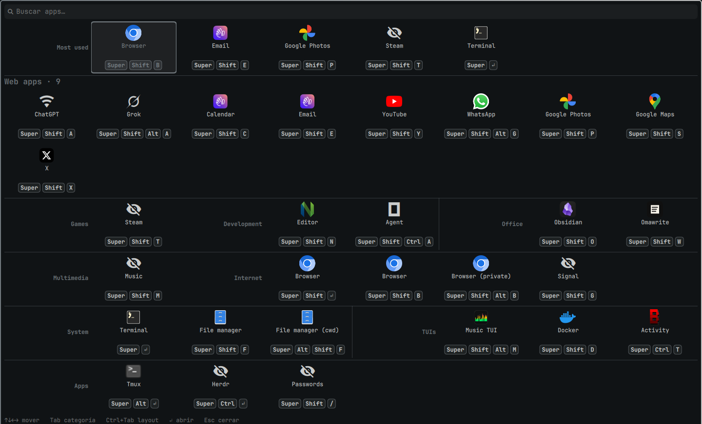
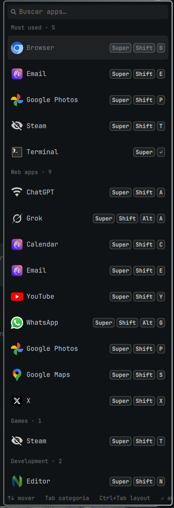

# LauncherPlease

A themed overlay of every app that has a shortcut, for [Omarchy](https://omarchy.org) Quattro (Hyprland + omarchy-shell). Shows as a category grid, or as a right-docked full-height list.





## What it does

`SUPER + A` opens a full-screen overlay listing **only the apps that have a Hyprland shortcut** — the apps you actually use — grouped by category:

- **Most used** — apps you actually launch from this overlay, ranked by a rolling 14-day count (auto-promotes / demotes)
- **Web apps** — every `{ webapp = ... }` binding (ChatGPT, Email, YouTube, WhatsApp…)
- **TUIs** — every `{ tui = ... }` binding (Docker, Herdr, Music TUI…)
- **Games**, **Development**, **Office**, **Multimedia**, **Internet**, **System** — native apps (`{ launch = ... }` / `{ omarchy = ... }`), categorized automatically from each app's desktop-entry `Categories=`
- **Apps** — anything that didn't match a known category

The list is derived from your bindings at runtime, so there is no separate "favorites" list to keep in sync: **add a shortcut, and the app appears here.**

### How categorization works

Native apps are grouped by their [freedesktop `Categories=`](https://specifications.freedesktop.org/menu-spec/latest/apa.html) field (read from `/usr/share/applications/*.desktop`), mapped to friendly labels in priority order. For example `Game → Games`, `Development → Development`, `WebBrowser → Internet`, `Office/WordProcessor → Office`, `Audio/Video → Multimedia`, `FileManager/TerminalEmulator → System`. Omarchy launchers whose label doesn't match a desktop entry name (Terminal → Foot, Editor → Neovim…) have curated mappings in `list.sh`.

You can override or pin any app's category in `~/.config/omarchy/launcherplease.json`:

```json
{ "categories": { "Tmux": "System", "Music": "Multimedia" } }
```

Different from the standard launcher (`SUPER + SPACE`): that opens the full root menu; LauncherPlease is a curated grid of shortcut-backed apps only.

## Selection feedback

- **Navigate** with `↑↓←→` (or `PgUp`/`PgDn`) or the mouse — the focused cell **breathes** (scale pulse) with an **accent glow** ring from the current theme.
- **Tab** jumps between categories (first app of the next/previous category); **Ctrl+Tab** cycles the three layouts: grid *compact* → grid *roomy* → right-side *list*. The chosen layout is saved to `launcherplease.json` for next time.
- The **list** layout is a right-docked, full-height panel whose width auto-fits its content (it only grows when a long app name needs room). Every row shows the app icon on the left, the app name, and the shortcut pinned to the panel's right edge. Category headers follow the `showCategories` toggle.
- **Confirm** with `Enter`, a click, **or by pressing the app's own shortcut** while the overlay is open (e.g. `SUPER + SHIFT + E` for Email). The cell does a **retro bounce** with an expanding **accent burst ring**, then launches.
- **Search** with the box at the top: full-text search across name, category, shortcut, command and id. Type several words and any of them matching keeps the app. `Esc` clears the search, then closes.
- Follows the active Omarchy theme automatically via the shell's `Color.menu` / `Style` tokens.

## Install

```bash
omarchy plugin add https://github.com/VisorDTE/LauncherPlease.git --enable
```

Then add the trigger bind in `~/.config/hypr/bindings.lua` (change the key if you like):

```lua
o.bind("SUPER + A", "Shortcut apps launcher",
  "omarchy-shell launcherplease toggle")
```

Reload Hyprland (`hyprctl reload`).

> **Note:** `SUPER + A` currently has no binding in stock Omarchy, so it is safe. It is different from `SUPER + SHIFT + A` (ChatGPT), `SUPER + CTRL + A` (Audio panel), and `SUPER + SHIFT + CTRL + A` (Agent).

## Configure

Optional file: `~/.config/omarchy/launcherplease.json` (hot-reloads on save). Full example in `launcherplease.json.example`:

```json
{
  "columns": 8,
  "layout": "compact",
  "showChords": true,
  "showCategories": true,
  "captureChords": true,
  "duration": 0,
  "groupOrder": ["Most used", "Web apps", "Games", "Development", "Office", "Multimedia", "Internet", "System", "TUIs", "Apps"],
  "mostUsedCount": 8,
  "mostUsedDays": 14,
  "favorites": ["Terminal", "Browser", "Editor", "ChatGPT", "Agent"],
  "exclude": ["Google Maps"],
  "categories": { "Tmux": "System" },
  "effects": { "pulse": true, "glow": true, "bounce": true }
}
```

| Key | Default | Meaning |
|---|---|---|
| `columns` | `8` | Grid columns (ignored in list layout) |
| `layout` | `compact` | `"compact"` packs small categories onto shared rows; `"roomy"` starts each category on its own row; `"list"` shows a right-docked full-height list whose width fits its content (icon · name · shortcut). Cycle live with `Ctrl+Tab` (persists) |
| `showChords` | `true` | Show each app's shortcut (as keycaps in the grid, accent-tinted keys in the list) |
| `showCategories` | `true` | Render category headers |
| `captureChords` | `true` | While open, pressing an app's own shortcut confirms it (with the bounce) |
| `duration` | `0` | Auto-close after N ms; `0` stays open |
| `groupOrder` | `["Most used","Web apps","Games",…]` | Category order; unknown categories go last |
| `favorites` | `[]` | Labels pinned to the top of their category |
| `exclude` | `[]` | Labels (or ids) to hide |
| `categories` | `{}` | Per-app category overrides, e.g. `{ "Tmux": "System" }` |
| `mostUsedCount` | `8` | Max apps in the Most used row (0 disables the section) |
| `mostUsedDays` | `14` | Rolling window in days; unused apps drop out on their own |
| `effects.pulse` | `true` | Breathing scale on the focused cell |
| `effects.glow` | `true` | Accent glow ring on the focused cell |
| `effects.bounce` | `true` | Retro bounce + burst ring on confirm |

## How it works

- `list.sh` parses Omarchy's default bindings plus `~/.config/hypr/bindings.lua` and emits a JSON array of launchable apps (window-management binds, shell IPC and menus are skipped). Icons are resolved to the themed file from the active icon theme (falling back to the Omarchy icon font or a themed glyph), so each app shows the icon that matches the applied theme.
- While `captureChords` is on, opening the overlay temporarily rebinds each app's shortcut to the overlay's launch IPC (Hyprland stacks duplicate binds, so the original is unbound first) and restores the original command on close.
- `Esc` is bound while open and unbound on close, same pattern as WindowsPlease.

## Remove

```bash
omarchy plugin remove jose.launcherplease
```

If you ever remove the plugin while a captured chord was left behind (e.g. the shell died mid-capture), restore your bindings with `hyprctl reload`.

## Develop

```bash
cd ~/source/LauncherPlease
npm test
omarchy plugin validate .
```

Stack: Omarchy shell plugin (Quickshell/QML overlay), `hyprctl eval` for dynamic keybinds, Node `node --test` and bash for the data layer.

## License

MIT. See [LICENSE](LICENSE).
